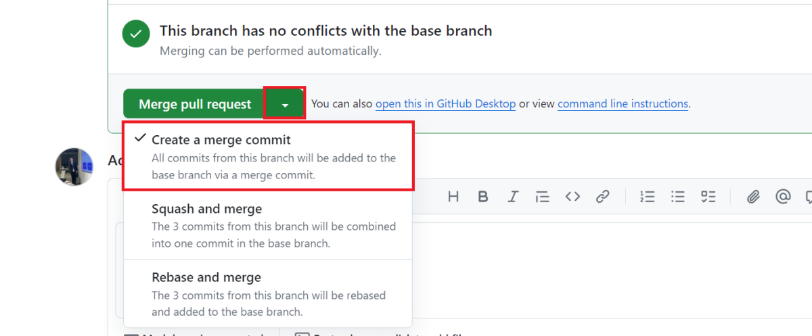
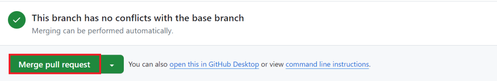
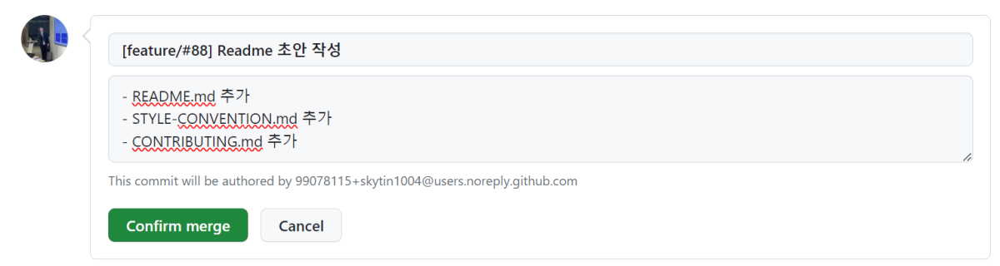

# IBAS Commiter

## Merge 하는 방법

IBAS Project는 현재 모든 PR에 대해서 Merge Commit을 적용하기로 결정했습니다.

현재 IBAS는 초기 프로젝트이기 때문에 PR의 규모가 커지면서 개별 커밋에 대한 상세한 히스토리를 유지하기 위해 Merge Commit을 적용하기로 결정했습니다.

추후 프로젝트 규모 및 PR의 규모 변동에 따라 Merge 방식이 다시 논의될 수 있습니다. 아래 논의를 참고해주세요.

- [PR Merge 방식에 대한 논의](https://github.com/InhaBas/Inhabas.com-api/issues/188)

### Merge 할 때 아래의 절차를 따라주세요

1. **Create a Merge Commit** 선택

    

2. **Merge pull request** 선택
    

3. Commit 제목, 본문 아래와 같이 수정, **Confirm merge** 선택
    

    > **NOTE:** IBAS Project의 Commit convention은 다음과 같습니다.
    >
    >```jsx
    >[feature/#67] 대댓글 UI 추가                   // header : [branch name] + title 
    >
    >- 대댓글 컴포넌트 생성                                     // body
    >- 댓글 컴포넌트에 대댓글 컴포넌트 달 수 있게 변경
    >
    >resolves: #67               // footer
    >see also: #56, #49 
    >```
