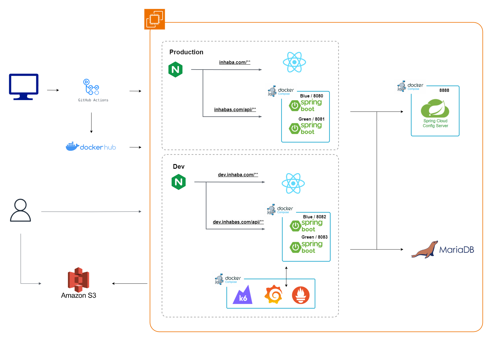
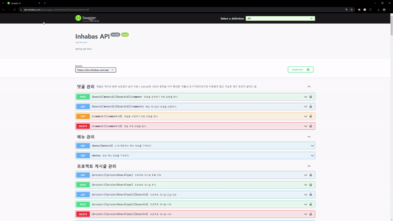
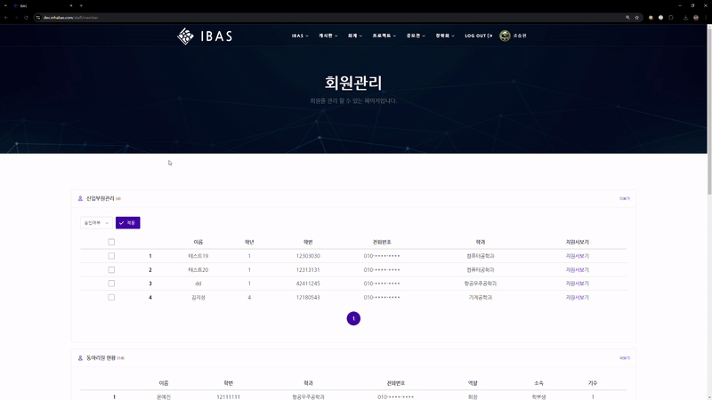
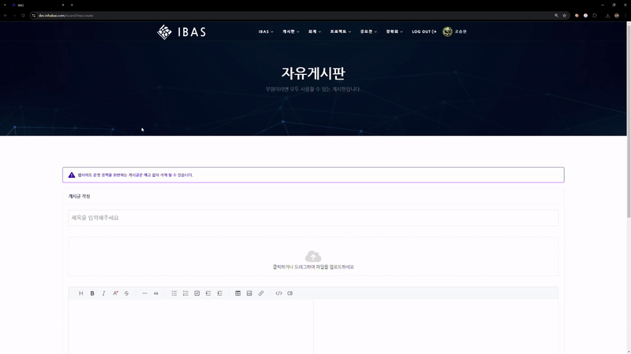
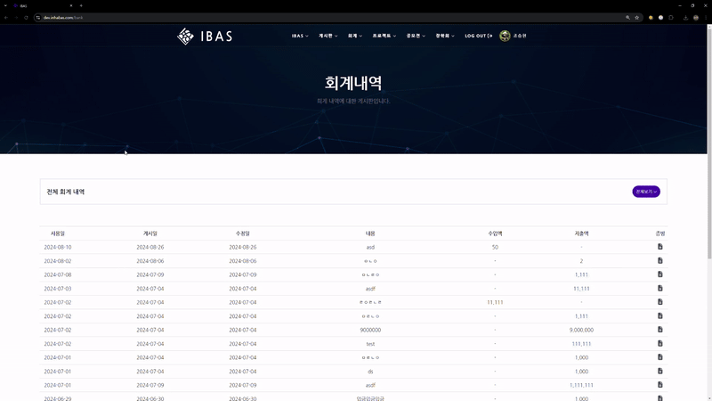

# IBAS (Inha Bigdata Analysis Society)

IBAS는 인하대학교의 빅데이터 학술동아리 입니다. 주로 데이터 분석 및 머신러닝 같은 데이터 관련 분야를 탐구하며, 웹 개발과 데이터 엔지니어링에 중점을 둔 IBAS 개발팀이 있어, 다양한 IT 분야에서의 활동을 지향하고 있습니다.

## IBAS Project

IBAS 공식 웹페이지는 인하대학교 빅데이터 학술 동아리의 활동과 비전을 효과적으로 전달하기 위해 개발되었습니다.

회원 등급에 따라 컨텐츠 접근 권한을 관리하여 안전한 자료 보관과 공유를 지원합니다. 또한, 간편한 회원 관리와 회계 관리 시스템을 통해 동아리 운영의 효율성을 높입니다. 주요 기능으로는 회원 등급 관리, 회계 내역 관리, 활동 및 공지사항 관리, 자료 공유 및 커뮤니케이션 플랫폼 등이 있습니다.

이 웹서비스는 해당 동아리의 특성에 맞게 커스터마이징 된 기능을 제공하는것에 중점을 두고 있습니다.

[IBAS 웹페이지 바로가기](https://www.inhabas.com/)

[2023.09~2024.07 웹서비스 개발 문서](https://sparkly-lunge-241.notion.site/IBAS-049505480e5f4bebbb01bfc9b1e9c3c0)

 

## Architecture

 

## Stacks
### Language & Framework
     

### Database
 

### Test
 

### Infra
     

### Documentation

 

## Style Convention

IBAS Project는 코드 품질과 가독성을 유지하기 위해 일관된 스타일 규약을 따르고 있습니다. 기여하기 전 아래 문서를 참고해주세요.

[STYLE-CONVENTION.md](STYLE-CONVENTION.md)

 

## Main Features

### Swagger를 활용한 API 명세

- 약 100개의 REST API
- 자세한 Request, Response 예시 제공
- Token 인증 방식을 활용한 권한 테스트 지원

 

### 회원관리

- 권한별 제한된 회원 등급 관리
- 신입 부원 가입 관리
- 권한별 개인정보 마스킹 처리

 

### 게시판

- 권한별, 게시판별 CRUD 
- 검색 기능
- 게시글 Markdown 형식, 미리보기 기능 제공
- 파일 업로드
  - 제한된 파일 확장자 
  - 데이터 검증으로 보안 문제 방지 
  - 난수 값을 활용한 파일명 저장
  - 미리보기, 확대 기능
  - 복수 파일 추가, 삭제 기능 
  - 다운로드 기능

 

### 댓글

- 권한별 CRUD
- 대댓글 기능
  - 계층적 UI 제공
  - 삭제 조건 세분화
    - 해당 댓글이 대댓글을 포함한 경우 `삭제된 댓글입니다.` 표시로 대체
    - 해당 댓글이 말단 댓글인 경우만 삭제

 

### 회계관리

- 총무만 CRUD 허용
  - 단, 이전 기수 총무가 작성한 것은 수정 불가
  - 총무가 직접 사용하지 않아 송금을 하는 경우, 예산지원 신청 심사를 거쳐 자동 기록
- 트랜잭션 관리로 동시성 제어
- 잔액 자동 계산 기능

 

### 그 외 여러가지 기능
- OAuth2 로그인
- 동아리 정책 관리
- 내 정보 관리
- 내가 쓴 글, 기록 관리
- 동아리 지원서 작성
- 동아리 연혁
- 공모전, 장학회 등 여러 형태의 게시판

 

## Problem documentation

### [자세한 내용](https://sparkly-lunge-241.notion.site/IBAS-049505480e5f4bebbb01bfc9b1e9c3c0)

- 회계 관련 동작 로직
- 권한 체계 정책
- 회원가입 과정 동작 로직
- OAuth 회원가입 동작 로직
- 등급 하락 시 접근 권한 정책
- 첨부 가능한 파일 확장자
- ec2 root 계정 분실로 인한 서버 이전 방법
- Blue/Green 배포 (Nginx + github actions) without Docker
- Blue/Green 배포 (Nginx + github actions + Docker compose)
- forked repository PR에서 pull_request시 secrets값을 가져오지 못하는 오류
- JPA 성능 최적화

 

## How to contribute to IBAS

IBAS에 소속된 회원이라면 누구든지 이 프로젝트에 기여할 수 있습니다.

아래 기여 가이드라인을 확인하고 기여해주세요.

1. PR 올리는 경우

   [CONTRIBUTING.md](CONTRIBUTING.md)

2. PR Merge 하는 경우

   [COMMITER-INSTRUCTION.md](COMMITER-INSTRUCTION.md)

 

## Contributor Wall of Fame

